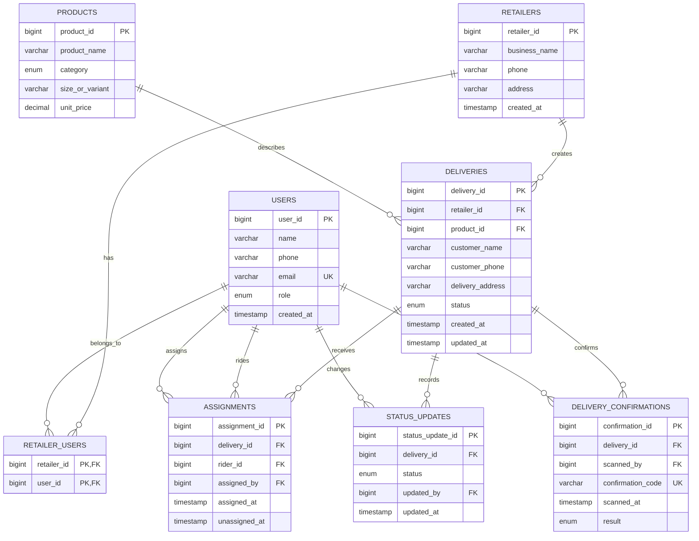

# Reflex Entity Relationship Diagram

The database uses a relational model. A retailer can have multiple staff users, a delivery belongs to one retailer, and a delivery can have many historical assignments and status updates.

